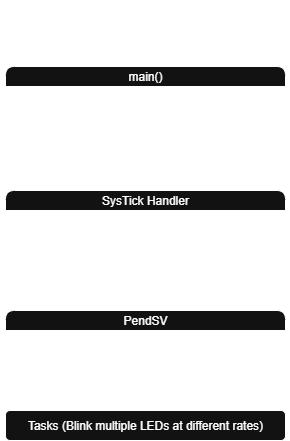

# Task Scheduler (STM32)

## Project 
I built a cooperative task scheduler on the STM32F4 Discovery board using SysTick and PendSV exceptions to toggle four LEDs concurrently, baremetal style.

It also includes custom startup code, a linker script, and a Makefile, so you can see how this project is built and linked from scratch on a MCU. 

## Diagram

*Shows flow of task switching between SysTick, PendSV, and user tasks.*

## What I Learned
- **SysTick & PendSV**: How to set up periodic system ticks and trigger context-switching exceptions to run multiple tasks concurrently 
- **Context Switching & Scheduling**: What happens when the processor saves and restores a task's state, and how round-robin scheduling works.
- **Stack Management & Execution Flow**: How each task needs its own stack and how the Cortex-M handles moving in and out of tasks without messing up memory.   
- **Debugging Hard Faults**: Using step-through debugging, inspecting disassembly, and reading fault registers to identify and fix runtime crashes.  
- **Task Info Tracking**: How to clearly track each task’s status, handlers, and stack pointer using structured tables for better scheduling control.  
- **Bare-Metal Build & Linking**: Created a custom startup file, linker script, and Makefile from scratch to see how the code actually gets loaded onto the MCU without an OS in between.
- **SysTick and PendSV Usage**: How to use system ticks and context-switching exceptions to manage multiple tasks.  
- **Context Switching & Scheduling**: What happens behind the scenes when the processor saves/restores task state and how round-robin scheduling works with states.
- **Stack Management & Execution Flow**: Learned how to set up individual task stacks, manage execution entry and exit, and observe how the ARM Cortex-M core handles task contexts.  
- **Debugging Faults**: Used step-through debugging, disassembly inspection, and fault registers to identify and resolve runtime errors.  
- **Task States Management**: Learned how to track and manage task states using structured tables for each type of state (e.g., ready, running, waiting).  
- **Bare-Metal Build & Linking**: Developed custom startup code, a linker script, and a Makefile to fully understand how a program is built and loaded onto the MCU

